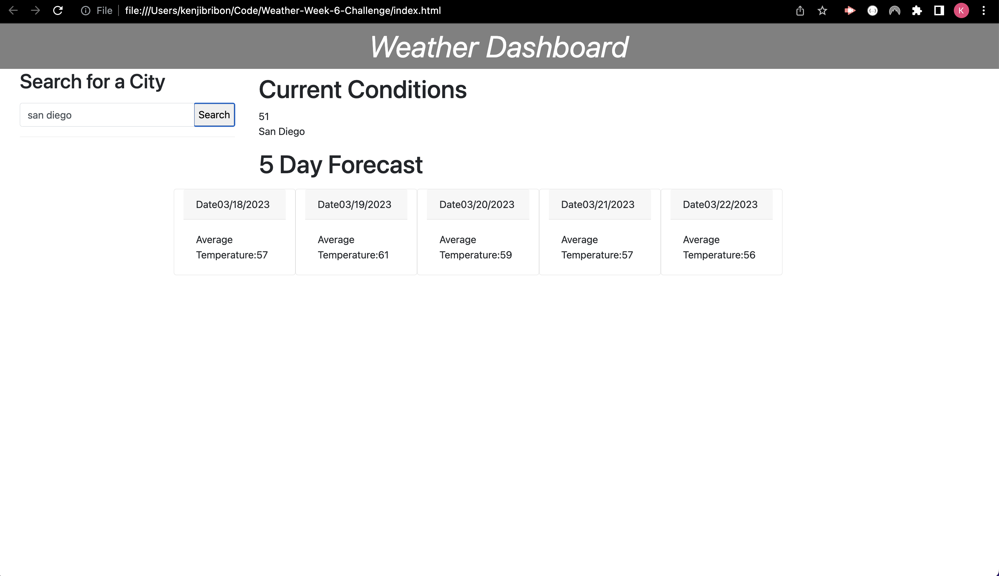

# Weather-Week-6-Challenge
HW 6
## Description

Creating a weather dashboard using the 5 Day Weather Forecast API to retrieve weather data for cities.
## Link

<https://kenjib32.github.io/Weather-Week-6-Challenge/>
## Screenshot

## Complied Criteria

* When a name of a city has been searched, it presents current and future conditions for that city and is added to hte search history.

* Scheduler is displayed when scrolling down the page along with different hours of the day.

* Time blocks are color-coded depending on the hour where user can differentiate current, have passed, or in the future.

* Text can be typed inside the remark block of each hour when clicked.

* Text that was typed inside the remark block can be saved into the local storage and when the application has been reopened, the text will be repopulated where it was saved, unless another text was saved or it got saved after being deleted.

## Repository

<https://github.com/Kenjib32/Weather-Week-6-Challenge>